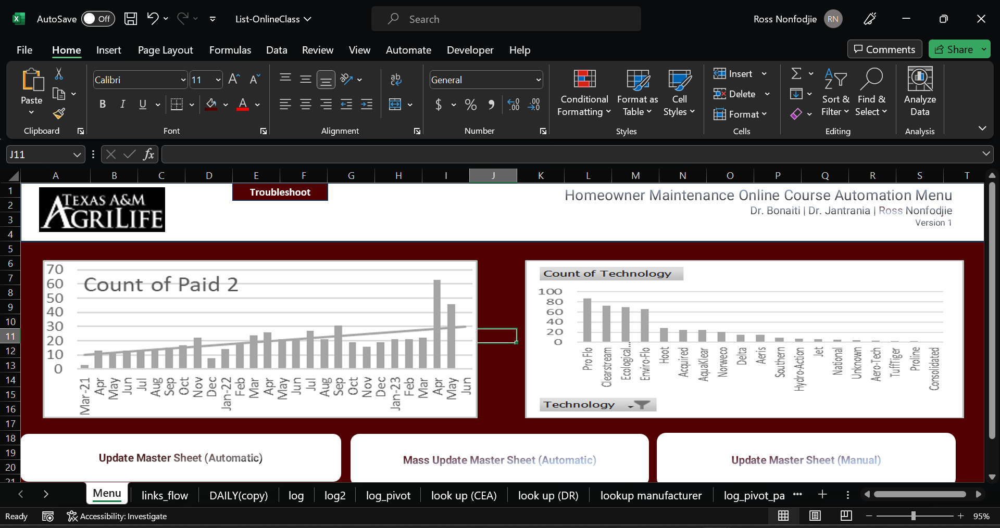
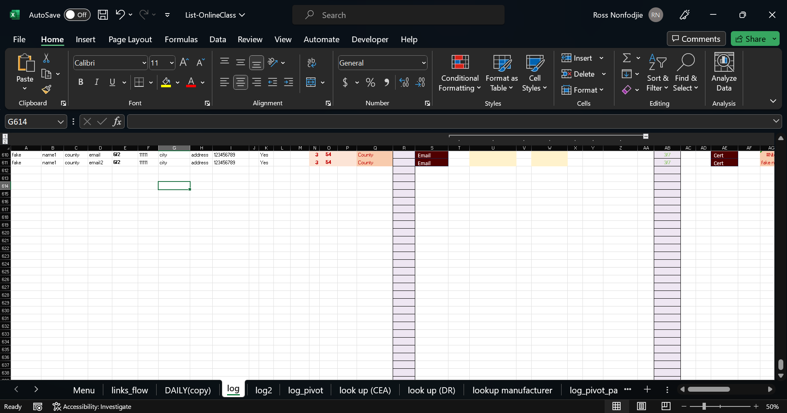
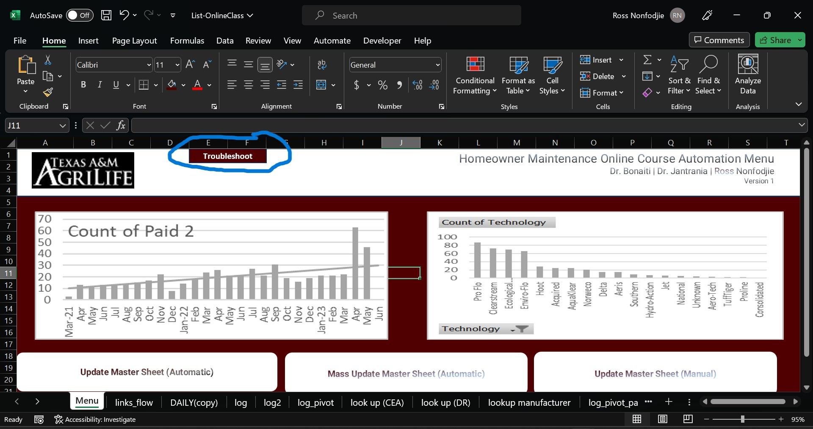

# HomeownerClassAutomation

## Setup
  In Chronological Order, Follow The Steps In These Videos: https://drive.google.com/drive/folders/1kQJWiv2BLN6wb9iiSNPkrloqLCJUYcGm?usp=drive_link 

  Ensure The Folder Housing Your "List-OnlineClass" File Has No Spaces
  Ensure This Folder Has The "password_protect_pdf" Python File (.py)
  Ensure This Folder Has The "HO to Learner (missing information)" Outlook Item Template File (.oft)
  Ensure In Your File Directory Settings You Has File Extensions Turned Off

## Instructions On Use

#### In The Menu Set Your Zoom To 95% For The Best User Experience

Button 1 - Update Master Sheet (Automatic) | Instantly seeks out daily file matching system date and uses that file to update the enrollments

Button 2 - Mass Update Master Sheet (Automatic) | Instantly seeks out all daily files from the last time the master sheet was updated up until the current system date, these files are used to update the enrollment

Button 3 - Update Master Sheet (Manual) | User must manually insert daily file name (excluding file exstension), this file will be used to update enrollment

Button 4 - Troubleshoot | This Button Will Run All Necessary Functions The Program Needs In Order To Function Properly. This Should Be The First Thing Used When Attempting To Resolve An Issue With The Program

#### In The Log Set Your Zoom Between 50%-80% For Best User Experince

Button 1 - Email | Will Automatically Generate A Missing Assignment/Information Email For The Enrollee In Which The Row The Email Button Was Clicked

Button 2 - Cert | Will Automatically Generate An Encrypted And Non-Encrypted Course Certification pdf For The Enrollee In The Row In Which The Button Was Click. Then Will Create Two Emails, One To The Enrollee's CEA and One To The Enrollee With The Enrollee's Course Certification

## Troubleshooting

#### Firstly Please Ensure You've Run The Troubleshoot Button In The Program Menu

#### If You're Running Into An Error While Using The Program; Please Use Ctrl + F To Type In Your Error And Hopefully You'll Find The Solution You're Looking For

